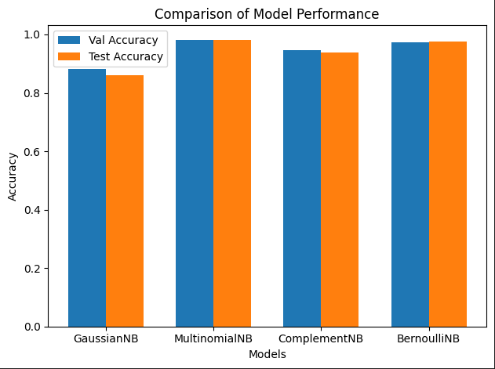

# Spam Text Classification

## Overview
This project implements a spam text classification system using various Naive Bayes classifiers. It processes and analyzes text messages to determine whether they are spam or legitimate (ham).

## Features
- Data preprocessing and feature extraction
- Implementation of multiple Naive Bayes classifiers:
    - Gaussian Naive Bayes
    - Multinomial Naive Bayes
    - Complement Naive Bayes
    - Bernoulli Naive Bayes
- Model training and evaluation
- Comparison of model performances
- Prediction functionality for new text inputs

## Installation
To set up the environment, follow these steps:
1. Clone the repository:
```bash
  git clone https://github.com/yourusername/spam-text-classification.git
```

2. Navigate to the project directory:
```bash
  cd spam-text-classification
```

## Usage
To run the classification system:
1. Ensure you have the dataset file '2cls_spam_text_cls.csv' in the project directory.
2. Run the Jupyter notebook or Python script:
```bash
  jupyter notebook Spam_Text_Classification_Naive_Bayes.ipynb
```
3. Follow the notebook cells or script execution to:
- Load and preprocess the data
- Train the models
- Evaluate model performance
- Make predictions on new text inputs

## Model Performance
The project compares the performance of different Naive Bayes classifiers. Here's a sample of the results:

<div align="center">
  
</div>